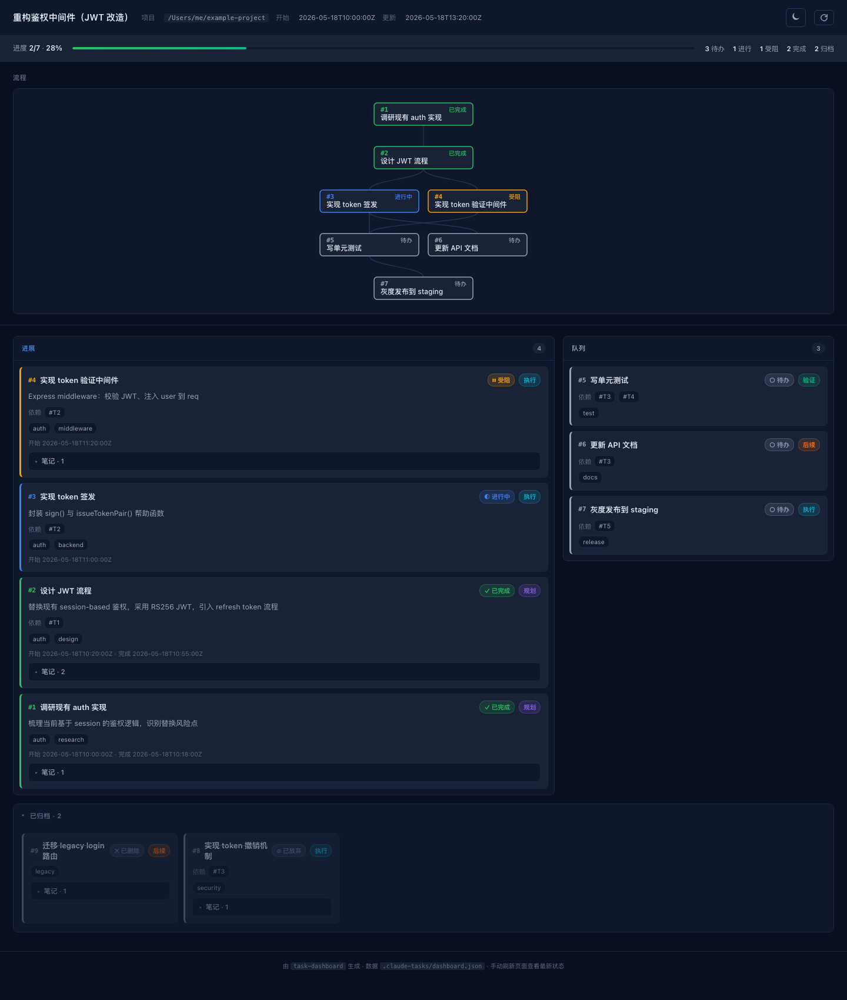
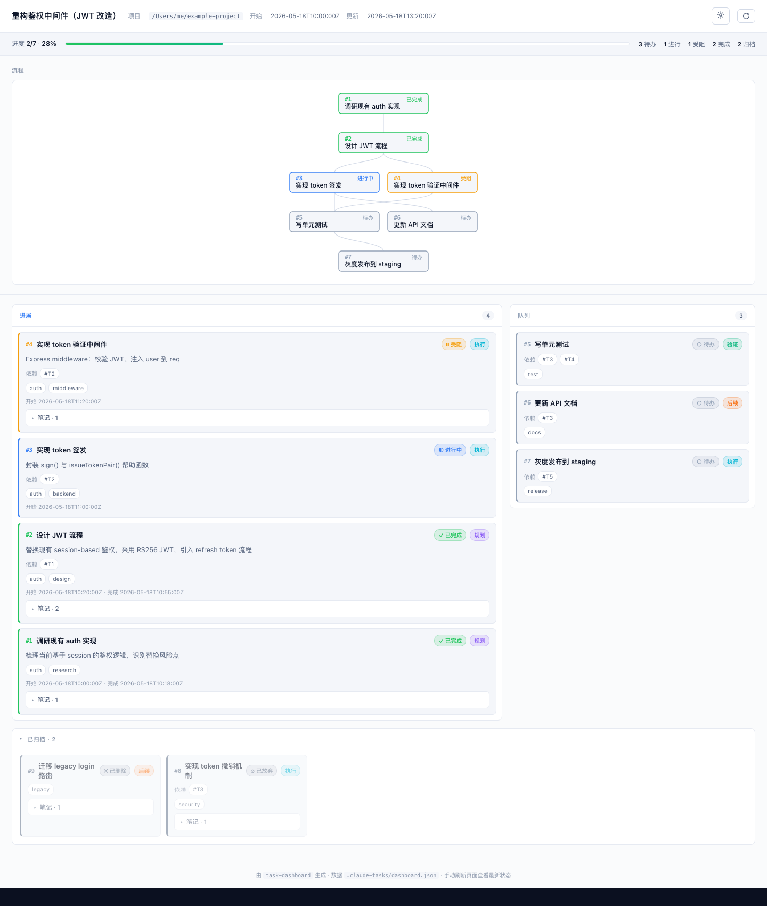

# task-dashboard

[](https://github.com/Octo-o-o-o/task-dashboard/releases/latest)
[](LICENSE)
[](https://code.claude.com/docs/en/skills)
[](https://github.com/anthropics/skills)

A [Claude Code skill](https://code.claude.com/docs/en/skills) that maintains a beautiful, self-contained HTML dashboard so you can watch Claude work through multi-step tasks in your browser.

> 一个 Claude Code skill，在执行多步骤任务时维护一份漂亮的、自包含的 HTML 看板，让你可以在浏览器里实时看到 Claude 正在做什么、做完了什么、任务之间怎么关联。



<details>
<summary>Light theme preview</summary>



</details>

## Features

- **Single-file HTML** at `.claude-tasks/dashboard.html` — double-click to open, no server, no dependencies.
- **Auto-laid-out SVG flow chart** based on `depends_on` — wraps each layer onto multiple rows when wide, and replaces fan-out spaghetti with a clean **bus-style** connector when a node has many children.
- **Two-track board**: a chronological **feed** (in-progress + blocked + completed, newest first) on the left two-thirds; an **upcoming queue** on the right one-third; archived tasks tucked into a collapsible footer. Layout collapses gracefully when the queue is empty.
- **Persistent history** — `abandoned` / `deleted` tasks are kept with their reasons. Never silently removed.
- **Single command, two modes** — type `/task-dashboard` mid-session and the skill decides whether to initialize from scratch or reconstruct from prior conversation. On first creation Claude auto-opens the dashboard in your default browser so you don't have to hunt for the `.claude-tasks/` hidden directory.
- Dark & light themes · keyboard navigation · `prefers-reduced-motion` support.
- Python 3 stdlib only · zero `pip install`.

## How it triggers

The skill activates when:

- You type `/task-dashboard` (with or without a task description), or say "open the task dashboard" / "维护任务看板" / "task dashboard".
- You ask mid-session like "give me a task board, I'm losing track" — Claude reconstructs one from the conversation history.
- `.claude-tasks/dashboard.json` already exists in the project — Claude keeps it in sync automatically.

It does **not** auto-trigger just because a task has many steps. You ask, it shows up.

## Installation

### Option A — Claude Code (Git clone)

```bash
git clone https://github.com/Octo-o-o-o/task-dashboard ~/.claude/skills/task-dashboard
```

Claude Code picks up skills under `~/.claude/skills/` automatically. No restart needed.

Project-scoped instead:

```bash
git clone https://github.com/Octo-o-o-o/task-dashboard .claude/skills/task-dashboard
```

### Option B — Claude.ai (`.skill` archive)

Download the latest `task-dashboard.skill` from [Releases](https://github.com/Octo-o-o-o/task-dashboard/releases/latest) and drag it into [claude.ai](https://claude.ai) settings → Skills.

## Try it without Claude

The renderer is just a Python script. Render the bundled sample and have it pop open in your browser:

```bash
python3 scripts/render.py references/example.json /tmp/dashboard.html --open
```

Drop the `--open` flag to render without launching a browser (e.g. for CI).

## How it works

1. Claude maintains `.claude-tasks/dashboard.json` — a small JSON file you can also edit by hand.
2. Whenever a task changes state, Claude runs `scripts/render.py` to regenerate the HTML.
3. You refresh your browser to see the latest state.

Data flow is one-way: Claude writes, you read. If you edit the JSON manually, Claude respects your version on the next sync.

## Layout

```
task-dashboard/
├── SKILL.md                # what Claude reads to know how to behave
├── scripts/
│   └── render.py           # JSON → HTML renderer (Python 3 stdlib only)
├── references/
│   ├── schema.md           # full JSON schema reference
│   ├── workflow.md         # how-to with concrete examples
│   └── example.json        # a complete sample you can render right now
└── assets/                 # README screenshots
```

## Designing your own tasks

- Data model: [references/schema.md](references/schema.md)
- Lifecycle examples (start, pause, abandon, delete, block): [references/workflow.md](references/workflow.md)
- A complete file you can copy: [references/example.json](references/example.json)

## Suggested `.gitignore`

Most people **don't** want the dashboard in version control:

```gitignore
.claude-tasks/
```

If you *do* want it in a PR for reviewers, commit the JSON but ignore the generated HTML:

```gitignore
.claude-tasks/dashboard.html
```

## Compatibility

- Python 3.9+ — standard library only, no third-party dependencies.
- Works in Claude Code, Claude.ai, and any runtime that respects the [Agent Skills spec](https://github.com/anthropics/skills/blob/main/spec/agent-skills-spec.md).
- Renderer is pure offline Python — never reaches the network.

## Contributing

Issues and PRs welcome. Before sending a PR:

1. Render `references/example.json` and confirm both dark and light themes look right.
2. If you changed `SKILL.md` frontmatter, run Anthropic's [`quick_validate.py`](https://github.com/anthropics/skills/blob/main/skills/skill-creator/scripts/quick_validate.py) to keep it Agent-Skills-compatible.

## License

MIT — see [LICENSE](LICENSE).
